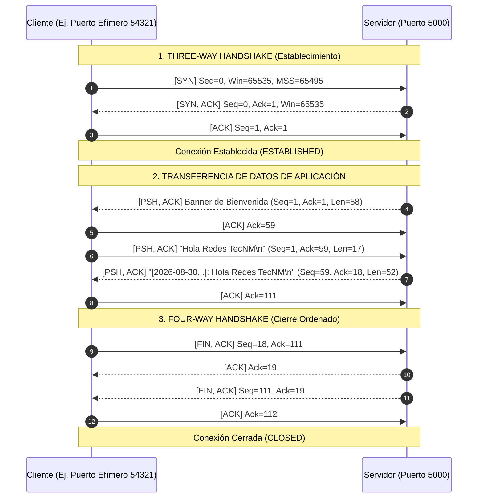

# Guía de Captura y Análisis en Wireshark: Handshake TCP/IP (3-Way Handshake)

Esta guía explica detalladamente cómo utilizar **Wireshark** para capturar, filtrar y analizar el tráfico generado entre el Servidor y el Cliente del sistema de Sockets TCP/IP desarrollado en **.NET 10** y **Java 21**.

---

## 1. Configuración de Wireshark para Tráfico Local (Loopback)

Al ejecutar tanto el cliente como el servidor en la misma máquina (`127.0.0.1` o `localhost`), los paquetes no viajan por la tarjeta de red física (Ethernet/Wi-Fi). Por ello, es necesario seleccionar la interfaz adecuada:

1. Abrir **Wireshark**.
2. En la lista de interfaces de captura inicial, seleccionar:
   - **En Windows:** `Adapter for loopback traffic capture` (o `Npcap Loopback Adapter`).
   - *(Si no aparece, asegurarse de haber instalado Npcap con soporte para Loopback al instalar Wireshark).*
3. Hacer doble clic sobre dicha interfaz para comenzar la captura en vivo.

---

## 2. Filtros de Visualización en Wireshark

Para aislar únicamente el tráfico de nuestra aplicación de sockets y evitar ruido del sistema operativo:

### Filtro General del Puerto:
```wireshark
tcp.port == 5000
```

### Filtro Específico para Handshake y Cierre (Banderas TCP):
```wireshark
tcp.port == 5000 and (tcp.flags.syn == 1 or tcp.flags.fin == 1 or tcp.flags.reset == 1 or tcp.flags.push == 1)
```

---

## 3. Análisis del Establecimiento de Conexión: El Three-Way Handshake

Cuando el cliente invoca `ConnectAsync()` (.NET) o `socket.connect()` (Java), el stack TCP del sistema operativo inicia la negociación de tres vías antes de transferir datos:



---

## 4. Desglose Detallado de Paquetes en Wireshark

### Paquete 1: `[SYN]` (Cliente -> Servidor)
- **Info en Wireshark:** `54321 → 5000 [SYN] Seq=0 Win=65535 Len=0 MSS=65495 WS=256`
- **Explicación:** El cliente solicita sincronización con un número de secuencia inicial aleatorio (ISN = 0 relativo).
- **Campos clave inspeccionables en el panel inferior:**
  - `Transmission Control Protocol -> Flags: 0x002 (SYN)`
  - `Flags: ......1. = Syn: Set`

### Paquete 2: `[SYN, ACK]` (Servidor -> Cliente)
- **Info en Wireshark:** `5000 → 54321 [SYN, ACK] Seq=0 Ack=1 Win=65535 Len=0 MSS=65495 WS=256`
- **Explicación:** El servidor acepta la conexión, reconoce el SYN del cliente sumando 1 al número de acuse (`Acknowledgment number = 1`) y envía su propio SYN.
- **Campos clave:**
  - `Flags: 0x012 (SYN, ACK)`
  - `Acknowledgment number: 1 (relative ack number)`

### Paquete 3: `[ACK]` (Cliente -> Servidor)
- **Info en Wireshark:** `54321 → 5000 [ACK] Seq=1 Ack=1 Win=65535 Len=0`
- **Explicación:** El cliente confirma la recepción del SYN del servidor. A partir de este momento, el socket pasa a estado `ESTABLISHED` y el servidor despierta de la llamada bloqueante `AcceptAsync()` / `accept()`.
- **Campos clave:**
  - `Flags: 0x010 (ACK)`

---

## 5. Transferencia de Datos (`PSH, ACK`)

- En la captura, los mensajes de aplicación viajan con la bandera **PSH (Push)** activada.
- Esto le indica al receptor TCP que entregue los datos inmediatamente a la aplicación (.NET / Java) sin esperar a llenar el búfer del sistema operativo.
- Al seleccionar cualquier paquete `PSH, ACK` en Wireshark, el panel inferior mostrará la trama de datos UTF-8 en texto claro.

---

## 6. Procedimiento para Captura en la Práctica de Laboratorio

1. Iniciar Wireshark con el filtro `tcp.port == 5000`.
2. En una consola, iniciar el Servidor (ej. `dotnet run --project TcpSocketSystem_DotNet/apps/ServidorApp/ServidorApp.csproj -- 5000`).
3. En otra consola, iniciar el Cliente (ej. `dotnet run --project TcpSocketSystem_DotNet/apps/ClienteApp/ClienteApp.csproj -- 127.0.0.1 5000`).
4. Seleccionar la opción `1` (Modo Eco Interactivo).
5. Enviar el texto `Prueba de Handshake TecNM`.
6. Escribir `QUIT` y dar Enter.
7. Detener la captura en Wireshark con el botón rojo cuadrado.
8. **Para el reporte:**
   - Hacer clic derecho sobre cualquiera de los paquetes de la conversación -> **Follow -> TCP Stream** para ver la transcripción completa de la conversación bidireccional (Cliente en rojo, Servidor en azul).
   - Tomar capturas de pantalla de los 3 primeros paquetes resaltando las banderas `SYN`, `SYN-ACK` y `ACK`.
