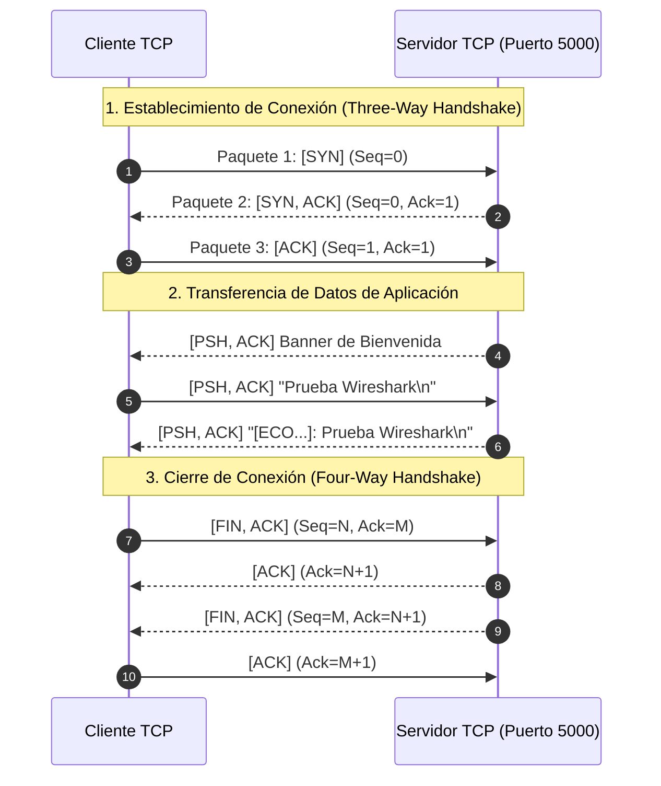

# 🌐 Sistema de Sockets TCP/IP Concurrente e Interoperable (TecNM)
### 🏛️ Arquitectura Grita (*Screaming Architecture*), .NET 10 (C#) y Java 21 (Virtual Threads)

Este repositorio contiene la solución profesional, modular y completa para la **Práctica de Laboratorio: Sockets TCP/IP del Tecnológico Nacional de México (TecNM)**. Está diseñado bajo los principios de **Screaming Architecture**, **Clean Code** y la **Guía de Estándares de Seguridad y Arquitectura** (ISO 27001).

---

## 📑 Tabla de Contenidos
1. [Visión General y Tecnologías](#1-visión-general-y-tecnologías)
2. [Estructura del Proyecto (Screaming Architecture)](#2-estructura-del-proyecto-screaming-architecture)
3. [Detalle y Función de Cada Programa](#3-detalle-y-función-de-cada-programa)
4. [Guía de Compilación y Ejecución](#4-guía-de-compilación-y-ejecución)
5. [Guía de Uso del Cliente (Menú Interactivo)](#5-guía-de-uso-del-cliente-menú-interactivo)
6. [Resolución Paso a Paso de los 4 Ejercicios del Laboratorio](#6-resolución-paso-a-paso-de-los-4-ejercicios-del-laboratorio)
7. [Guía de Captura y Análisis en Wireshark (Handshake TCP)](#7-guía-de-captura-y-análisis-en-wireshark-handshake-tcp)
8. [Estándares de Seguridad, Auditoría y Hardening](#8-estándares-de-seguridad-auditoría-y-hardening)

---

## 1. Visión General y Tecnologías

El sistema implementa una arquitectura cliente-servidor basada en el protocolo de transporte **TCP/IP**, garantizando comunicación confiable, control de flujo, multihilo no bloqueante e interoperabilidad cruzada total entre plataformas heterogéneas.

### 🛠️ Stack Tecnológico
- **C# / .NET 10**:
  - `System.Net.Sockets.TcpListener`, `TcpClient`, `NetworkStream`.
  - Concurrencia asíncrona mediante `async/await` y `Task.Run`.
  - Suite de pruebas con MSTest en .NET 10.
- **Java 21 LTS (HotSpot / Adoptium)**:
  - `java.net.ServerSocket`, `java.net.Socket`, `BufferedReader`, `BufferedWriter`.
  - Concurrencia ligera con **Virtual Threads** (`GestorHilos` / Project Loom).
- **Protocolo de Comunicación**:
  - Mensajería de texto estructurado codificada en **UTF-8**, delimitada por saltos de línea (`\n`), lo que garantiza que cualquier cliente hable con cualquier servidor sin importar el lenguaje.

---

## 2. Estructura del Proyecto (Screaming Architecture)

La arquitectura "grita" la intención del dominio del problema y desacopla la lógica de negocio de los detalles de red y frameworks:

```text
c:\Dev\Rriojas\Nueva carpeta\
│
├── 🔷 TcpSocketSystem_DotNet/                 # MÓDULO .NET 10 (C#)
│   ├── TcpSocketSystem.slnx                  # Solución moderna de Visual Studio / .NET CLI
│   ├── src/
│   │   ├── TcpSocketSystem.Core.csproj       # Biblioteca de Dominio, Casos de Uso e Infraestructura
│   │   ├── Domain/                           # CAPA 1: Reglas de Negocio Puras y Puertos
│   │   │   ├── Modelos/                      # Entidades inmutables
│   │   │   │   ├── MensajeEco.cs             # Modelo con sanitización y formateo de trama
│   │   │   │   └── EstadoSesion.cs           # Trazabilidad de conexiones y estadísticas
│   │   │   └── Puertos/                      # Contratos e interfaces (Inversión de dependencias)
│   │   │       ├── ISocketConexion.cs        # Abstracción del socket individual
│   │   │       ├── IServicioRed.cs           # Abstracción del listener del servidor
│   │   │       ├── IRepositorioSesiones.cs   # Abstracción de persistencia de sesiones
│   │   │       └── IServicioLogging.cs       # Abstracción de bitácoras y auditoría
│   │   ├── UseCases/                         # CAPA 2: Casos de Uso de Aplicación
│   │   │   ├── ProcesarEco/                  # IProcesarEcoUseCase & ProcesarEcoHandler
│   │   │   └── GestionarSesiones/            # IGestionarSesionesUseCase & GestionarSesionesHandler
│   │   └── Infrastructure/                   # CAPA 3: Implementaciones Técnicas y Adaptadores
│   │       ├── Network/                      # TcpServidorSocket, TcpClienteSocket, TcpConexionWrapper
│   │       ├── Logging/                      # LoggerAuditoria (Consola ANSI + Archivo rotativo)
│   │       └── Repositories/                 # RepositorioSesionesMemoria (Thread-safe)
│   └── apps/                                 # Puntos de Entrada Ejecutables
│       ├── ServidorApp/                      # Aplicación Servidor de Consola (Program.cs)
│       └── ClienteApp/                       # Aplicación Cliente de Consola (Program.cs)
│
├── ☕ TcpSocketSystem_Java/                   # MÓDULO JAVA 21 (LTS)
│   ├── pom.xml                               # Descriptor Maven configurado para Java 21
│   └── src/com/tecnm/sockets/
│       ├── domain/                           # Capa 1: Modelos y Puertos en Java
│       │   ├── modelos/                      # MensajeEco.java, EstadoSesion.java
│       │   └── puertos/                      # ISocketConexion, IServicioRed, IRepositorioSesiones, IServicioLogging
│       ├── usecases/                         # Capa 2: Casos de Uso en Java
│       │   ├── procesareco/                  # IProcesarEcoUseCase, ProcesarEcoHandler
│       │   └── gestionarsesiones/            # IGestionarSesionesUseCase, GestionarSesionesHandler
│       ├── infrastructure/                   # Capa 3: Adaptadores de Red y Sockets
│       │   ├── network/                      # TcpServidorSocket, TcpClienteSocket, TcpSocketConexion, GestorHilos
│       │   ├── logging/                      # LoggerAuditoria.java
│       │   └── repository/                   # RepositorioSesionesMemoria.java
│       └── app/                              # Aplicaciones Ejecutables
│           ├── ServidorApp.java              # Servidor Multihilo Java 21 (Main)
│           └── ClienteApp.java               # Cliente Interactivo Java 21 (Main)
│
├── 🧪 Tests/                                  # SUITE DE PRUEBAS AUTOMATIZADAS
│   └── TcpSocketSystem.Tests/                # 5 pruebas unitarias e integración en .NET 10
│       └── UnitAndIntegrationTests.cs
│
├── 📚 Docs/                                   # DOCUMENTACIÓN COMPLETA
│   ├── Manual_Ejecucion_y_Pruebas.md         # Guía de laboratorio paso a paso
│   └── Guia_Captura_Wireshark_Handshake.md   # Manual de Wireshark y Three-Way Handshake
│
├── 🛡️ Estandares_Seguridad_Arquitectura.md    # Lineamientos de seguridad y Clean Code
└── 📖 README.md                               # Este documento
```

---

## 3. Detalle y Función de Cada Programa

### 🔷 Módulo .NET 10 (C#)

#### 1. `ServidorApp` (`TcpSocketSystem_DotNet/apps/ServidorApp/Program.cs`)
- **Función:** Servidor TCP multihilo no bloqueante.
- **Mecanismo:** Escucha en `0.0.0.0:[puerto]` utilizando `TcpListener`. Cada cliente que se conecta es despachado en un hilo de trabajo en segundo plano con `Task.Run` y procesado asíncronamente con `async/await`.
- **Características:**
  - Envía banner de bienvenida interoperable con ID de sesión único.
  - Recibe tramas, valida y sanitiza entradas, y responde con el eco formateado.
  - Soporta el comando `QUIT` para desconexión limpia.
  - Captura desconexiones abruptas sin caerse y realiza apagado ordenado (*Graceful Shutdown*) al presionar `Ctrl+C`.

#### 2. `ClienteApp` (`TcpSocketSystem_DotNet/apps/ClienteApp/Program.cs`)
- **Función:** Cliente TCP de consola con menú interactivo.
- **Características:**
  - Permite conectarse a cualquier host/puerto (local o remoto).
  - Política de conexión con reintentos y timeouts configurados.
  - Incluye generador de carga multicliente simultáneo (lanza 5 tareas concurrentes en paralelo).
  - Prueba de resiliencia y timeouts ante puertos cerrados.

---

### ☕ Módulo Java 21 (LTS)

#### 1. `ServidorApp` (`TcpSocketSystem_Java/src/com/tecnm/sockets/app/ServidorApp.java`)
- **Función:** Servidor TCP de alta concurrencia en Java.
- **Mecanismo:** Utiliza `ServerSocket` combinado con **Virtual Threads** a través de `GestorHilos`. Cada conexión se procesa en un hilo virtual ultra-ligero sin consumir recursos del sistema operativo.
- **Características:**
  - Identificador de sesión UUID para cada cliente.
  - Registro de auditoría conforme a ISO 27001 en archivo y consola.
  - Hook de apagado ordenado (`Runtime.getRuntime().addShutdownHook`).

#### 2. `ClienteApp` (`TcpSocketSystem_Java/src/com/tecnm/sockets/app/ClienteApp.java`)
- **Función:** Cliente TCP interactivo en Java 21.
- **Características:**
  - Menú de opciones idéntico al de C#.
  - Modo interactivo para chat de eco en tiempo real.
  - Prueba multicliente simultáneo con Virtual Threads.

---

## 4. Guía de Compilación y Ejecución

### 4.1 Ejecución Rápida con Scripts Multiplataforma

Se incluyen scripts parametrizados tanto para **Windows / PowerShell (`.ps1`)** como para **Linux / macOS Bash (`.sh`)**:

#### 🪟 En Windows (PowerShell):
```powershell
# Ejecutar Servidor .NET 10 (Puerto 5000 por defecto)
pwsh ./ejecutar_servidor_dotnet.ps1 -Puerto 5000

# Ejecutar Cliente .NET 10
pwsh ./ejecutar_cliente_dotnet.ps1 -HostDestino 127.0.0.1 -Puerto 5000

# Ejecutar Servidor Java 21 (Virtual Threads)
pwsh ./ejecutar_servidor_java.ps1 -Puerto 5000

# Ejecutar Cliente Java 21
pwsh ./ejecutar_cliente_java.ps1 -HostDestino 127.0.0.1 -Puerto 5000
```

#### 🐧 En Linux / macOS (Bash):
```bash
# Dar permisos de ejecución la primera vez:
chmod +x *.sh

# Ejecutar Servidor .NET 10
./ejecutar_servidor_dotnet.sh 5000

# Ejecutar Cliente .NET 10
./ejecutar_cliente_dotnet.sh 127.0.0.1 5000

# Ejecutar Servidor Java 21
./ejecutar_servidor_java.sh 5000

# Ejecutar Cliente Java 21
./ejecutar_cliente_java.sh 127.0.0.1 5000
```

---

### 4.2 Compilación y Ejecución Manual

#### 1. Compilación
```powershell
# Compilar y verificar suite de pruebas de .NET 10
dotnet test TcpSocketSystem_DotNet/TcpSocketSystem.slnx

# Compilar el proyecto Java 21
& "C:\Program Files\Eclipse Adoptium\jdk-21.0.11.10-hotspot\bin\javac.exe" -encoding UTF-8 -d TcpSocketSystem_Java/bin (Get-ChildItem -Recurse -Filter *.java TcpSocketSystem_Java/src).FullName
```

#### 2. Ejecución Manual del Servidor
| Lenguaje | Comando de Ejecución |
| :--- | :--- |
| **.NET 10 (C#)** | `dotnet run --project TcpSocketSystem_DotNet/apps/ServidorApp/ServidorApp.csproj -- 5000` |
| **Java 21 (VT)** | `& "C:\Program Files\Eclipse Adoptium\jdk-21.0.11.10-hotspot\bin\java.exe" -cp TcpSocketSystem_Java/bin com.tecnm.sockets.app.ServidorApp 5000` |

#### 3. Ejecución Manual del Cliente
| Lenguaje | Comando de Ejecución |
| :--- | :--- |
| **.NET 10 (C#)** | `dotnet run --project TcpSocketSystem_DotNet/apps/ClienteApp/ClienteApp.csproj -- 127.0.0.1 5000` |
| **Java 21 (VT)** | `& "C:\Program Files\Eclipse Adoptium\jdk-21.0.11.10-hotspot\bin\java.exe" -cp TcpSocketSystem_Java/bin com.tecnm.sockets.app.ClienteApp 127.0.0.1 5000` |

> [!TIP]
> Puedes especificar una IP remota en lugar de `127.0.0.1` si vas a probar entre dos computadoras en la misma red local (ej. `192.168.1.50 5000`).

---

## 5. Guía de Uso del Cliente (Menú Interactivo)

Al iniciar cualquiera de los clientes (`ClienteApp` de C# o Java), se presentará el siguiente menú en consola:

```text
===================================================================
  TECNM - LABORATORIO DE SOCKETS TCP/IP (SCREAMING ARCHITECTURE)   
  Módulo de Cliente de Red TCP
===================================================================

Destino actual configurado: 127.0.0.1:5000
--------------------------------------------------
1. Iniciar Sesión Interactiva de Eco (Envío continuo)
2. Ejecutar Prueba Multicliente Simultáneo (5 clientes concurrentes)
3. Prueba de Resiliencia / Timeout (Intento con servidor inexistente)
4. Cambiar Dirección IP / Puerto
5. Salir
Selecciona una opción [1-5]:
```

### Explicación de las Opciones:

- **Opción 1: Iniciar Sesión Interactiva de Eco**
  - Conecta el socket al servidor.
  - Permite escribir mensajes de texto libremente. Al presionar `Enter`, el cliente envía la trama y recibe la respuesta del servidor en tiempo real.
  - Para finalizar la sesión limpiamente, escribe `QUIT` o `SALIR`.

- **Opción 2: Ejecutar Prueba Multicliente Simultáneo**
  - Dispara **5 clientes simultáneos en paralelo** (hilos virtuales / tareas asíncronas).
  - Cada cliente envía ráfagas de paquetes numerados y luego se desconecta ordenadamente con `QUIT`.
  - Demuestra que el servidor procesa múltiples clientes al mismo tiempo sin encolamiento ni bloqueos.

- **Opción 3: Prueba de Resiliencia / Timeout**
  - Intenta conectarse deliberadamente a un puerto cerrado (`59999`).
  - Ejecuta la política de reintentos exponenciales y muestra el mensaje controlado de error sin propagar trazas de excepción no controladas.

- **Opción 4: Cambiar Dirección IP / Puerto**
  - Permite reconfigurar dinámicamente la IP de destino (ej. la IP de un compañero de laboratorio) y el puerto sin reiniciar la aplicación.

- **Opción 5: Salir**
  - Cierra la aplicación del cliente.

---

## 6. Resolución Paso a Paso de los 4 Ejercicios del Laboratorio

### 📌 Ejercicio 1: Flujo Básico de Eco Unidireccional / Bidireccional
1. Inicia el servidor en la Terminal 1 (`dotnet run --project TcpSocketSystem_DotNet/apps/ServidorApp/ServidorApp.csproj -- 5000`).
2. Inicia el cliente en la Terminal 2 (`dotnet run --project TcpSocketSystem_DotNet/apps/ClienteApp/ClienteApp.csproj -- 127.0.0.1 5000`).
3. Elige la **Opción 1**.
4. Escribe: `Hola Servidor TCP TecNM`.
5. Observa la respuesta:
   `[RECIBIDO] <- "[2026-08-30 22:15:00] [Servidor-CSharp] REPLY: Hola Servidor TCP TecNM"`
6. Escribe `QUIT` para cerrar el socket con el protocolo de fin de sesión.

---

### 📌 Ejercicio 2: Servidor Concurrente Multicliente
1. Con el servidor activo en el puerto 5000.
2. En la terminal del cliente, selecciona la **Opción 2**.
3. Observa cómo el servidor recibe y atiende 5 conexiones simultáneas (`SesionId` independientes) procesando todas las ráfagas en paralelo sin retrasos.

---

### 📌 Ejercicio 3: Prueba Heterogénea (Interoperabilidad Cruzada)
Demuestra que la arquitectura de red es totalmente agnóstica del lenguaje de programación:

#### Escenario A: Servidor en C# (.NET 10) + Cliente en Java (Java 21)
1. **Terminal 1:** Iniciar servidor .NET:
   ```bash
   dotnet run --project TcpSocketSystem_DotNet/apps/ServidorApp/ServidorApp.csproj -- 5000
   ```
2. **Terminal 2:** Iniciar cliente Java:
   ```powershell
   & "C:\Program Files\Eclipse Adoptium\jdk-21.0.11.10-hotspot\bin\java.exe" -cp TcpSocketSystem_Java/bin com.tecnm.sockets.app.ClienteApp 127.0.0.1 5000
   ```
3. Seleccionar **Opción 1** en el cliente Java y enviar mensajes. El servidor C# responderá inmediatamente.

#### Escenario B: Servidor en Java (Java 21) + Cliente en C# (.NET 10)
1. **Terminal 1:** Iniciar servidor Java:
   ```powershell
   & "C:\Program Files\Eclipse Adoptium\jdk-21.0.11.10-hotspot\bin\java.exe" -cp TcpSocketSystem_Java/bin com.tecnm.sockets.app.ServidorApp 5000
   ```
2. **Terminal 2:** Iniciar cliente .NET:
   ```bash
   dotnet run --project TcpSocketSystem_DotNet/apps/ClienteApp/ClienteApp.csproj -- 127.0.0.1 5000
   ```
3. Seleccionar **Opción 1** en el cliente .NET y enviar mensajes. El servidor Java procesará el eco mediante sus Virtual Threads.

---

### 📌 Ejercicio 4: Manejo de Errores y Excepciones
1. **Conflicto de Puerto Ocupado:** Inicia dos servidores en el mismo puerto (`5000`). El segundo capturará `AddressAlreadyInUse` / `BindException` de manera limpia y finalizará registrando el suceso en la auditoría sin tumbar el primer proceso.
2. **Caída Abrupta de Conexión:** Durante una sesión interactiva (Opción 1), presiona `Ctrl+C` en el cliente o cierra su ventana. El servidor capturará el fin de stream, limpiará la sesión en memoria y seguirá listo para nuevos clientes.
3. **Servidor Apagado:** Ejecuta la **Opción 3** en el cliente para verificar el manejo de timeouts y reintentos.

---

## 7. Guía de Captura y Análisis en Wireshark (Handshake TCP)

Para documentar la práctica con capturas de paquetes reales:

### 1. Iniciar Captura en Wireshark
1. Abrir **Wireshark**.
2. Seleccionar la interfaz de captura local:
   - En Windows: **`Adapter for loopback traffic capture`** (o `Npcap Loopback Adapter`).
3. En la barra de filtro de visualización superior, escribir:
   ```wireshark
   tcp.port == 5000
   ```
4. Presionar `Enter`.

### 2. Generar el Tráfico
1. Enciende el Servidor y luego el Cliente.
2. Conecta el cliente (Opción 1), envía un mensaje (ej. `Prueba Wireshark`) y escribe `QUIT`.
3. Detén la captura en Wireshark (botón rojo cuadrado).

### 3. Identificación del Three-Way Handshake
En la lista de paquetes capturados observarás las 3 fases del protocolo TCP:



- **Paso 1 `[SYN]`**: Bandera `Syn: Set` (0x002) enviada por el cliente pidiendo sincronización.
- **Paso 2 `[SYN, ACK]`**: El servidor responde con `Syn: Set, Ack: Set` (0x012) confirmando la recepción.
- **Paso 3 `[ACK]`**: El cliente responde con `Ack: Set` (0x010). La conexión pasa a estado `ESTABLISHED`.
- **Datos `[PSH, ACK]`**: Los mensajes viajan con la bandera `Push` activada para entrega inmediata a la capa de aplicación.

*(Para más detalles, consulta [Guia_Captura_Wireshark_Handshake.md](file:///c:/Dev/Rriojas/Nueva%20carpeta/Docs/Guia_Captura_Wireshark_Handshake.md)).*

---

## 8. Estándares de Seguridad, Auditoría y Hardening

Este desarrollo cumple con la [Guía de Estándares de Seguridad, Código Limpio y Arquitectura](file:///c:/Dev/Rriojas/Nueva%20carpeta/Estandares_Seguridad_Arquitectura.md):

1. **Principio de Inversión de Dependencias (DIP):** Las capas de dominio y casos de uso solo conocen interfaces (`ISocketConexion`, `IServicioRed`, `IRepositorioSesiones`, `IServicioLogging`), permitiendo sustituir la infraestructura de red sin alterar las reglas de negocio.
2. **Sanitización de Entradas (Input Validation):** Toda trama recibida es sanitizada mediante expresiones regulares en la entidad `MensajeEco` para neutralizar caracteres de inyección o secuencias maliciosas.
3. **Manejo de Errores Silencioso hacia el Cliente:** Ningún cliente remoto recibe *stack traces* o información sensible del servidor ante caídas o excepciones.
4. **Trazabilidad y Auditoría (Audit Trails ISO 27001):** Todo evento (conexión, desconexión, mensaje procesado, error de puerto) queda registrado en la carpeta `logs/` con timestamps UTC estandarizados.
